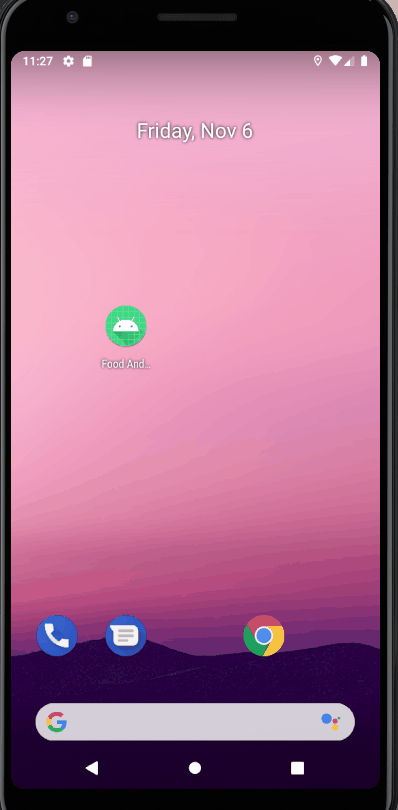

## FOOD AND COCKTAIL APP

I am building this app to learn more about how to work with 3rd party APIs. This app uses Retrofit and Room to store the data. Once it nears completion, this app will have two parts: the cocktail section, and the food recipe section. Each will use their own APIs but have relatively the same function. For each section, the user will be able to search for certain drinks/meals and the app will make API requests each time, displaying the results. Users can then select each result and get more detailed information.

Currently, users can only search for cocktails by name. Eventually, users will also be able to lookup ingredients, search by first letter, and get random cocktails. The food section has not even been planned out yet, but after the cocktail section is somewhat completed, then I will start working on the food section. 

The code structure was influenced by two YouTubers: Coding with Mitch, and Coding in Flow. Through multiple videos from both of them, I was able to create the design I have now. Originally, this app was also going to be built with dependency injection, however due to the complexity of DI and my lack of 3rd party API experience, I decided to only focus on API manipulation for this app. My next app will have DI in it, but that is some time in the future. Here is a GIF to show where the app is as of now:

